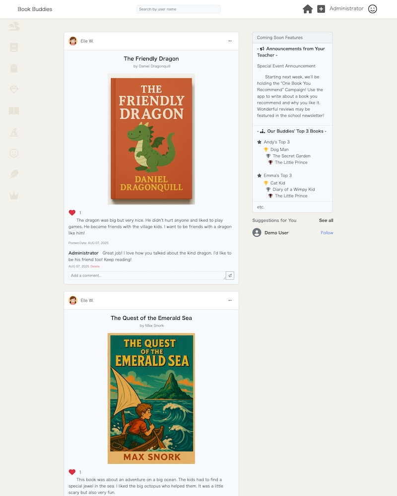
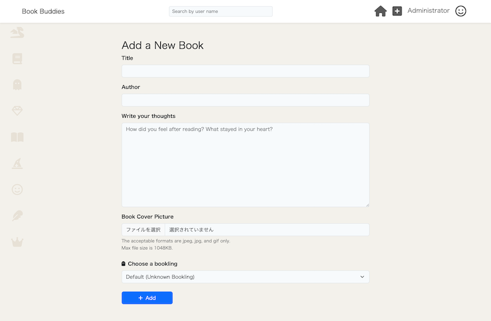
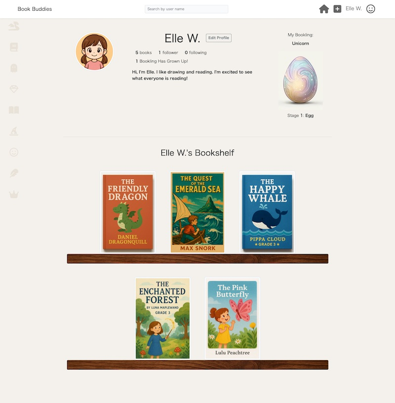
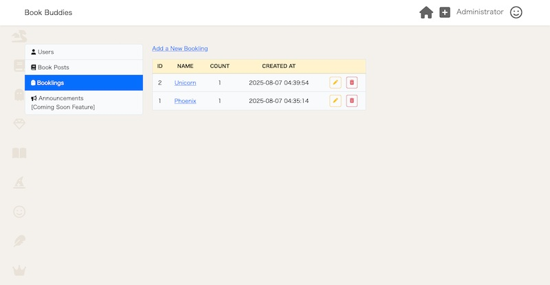

# 📚 Book Buddies - Reading Record Sharing App for Children(Built with Laravel)

Book Buddies is a web application designed for elementary school children to record and share their reading experiences, similar to Instagram. This app is intended for use in schools and encourages students to post reading records by introducing an evolving character system called **Bookling**, which evolves as students post more. Once evolution is complete, students can keep their Bookling character as a reward. 

The application also helps promote IT literacy among children and includes an admin panel intended for teachers to manage users and monitor student activity.

This app is based on an Instagram clone created during an online course under instructor guidance. To acquire practical, job-ready skills, I independently handled the entire process from planning and design to coding, Git/GitHub, and deployment.

## ✅ Features

- User registration and login
- CRUD functionality for posts(with image upload/base64)
- User search function
- Like and comment features
- Follow/unfollow functionality
- Admin panel for teachers
- Bookling character evolves based on post count

## 🛠️ Tech Stack

- Framework: Laravel 11.x
- Frontend: Blade template, Bootstrap 5.2.3, HTML & CSS
- Database: MySQL 8.0.40
- Authentication: Laravel UI (login, logout, user registration)
- Development environment: MAMP
- Others:
  - PHP 8.3.14
  - Validation
  - Base64 encoding used for image upload, update, and display
  - Font Awesome 6.7.2

## 💻 Local Setup

Clone the repository and perform basic Laravel setup to run the project.

## 📸 Screenshots / スクリーンショット

### Timeline View / タイムライン画面

EN:  

The timeline shows the latest posts from users you follow. Each post includes an image, caption, like button, and comments—offering a core social media experience.

**JP（日本語）：**  
ユーザーがフォローしている他のユーザーの投稿が、最新順にタイムラインとして表示されます。画像・テキスト・「いいね」・コメント機能など、SNSの基本要素を一画面で確認できます。

### Post Creation View / 投稿作成画面

EN:

Logged-in users can create posts by entering text and images and selecting a Bookling. Created posts can be viewed on the user’s My Page and in the post list, and can be edited or deleted later.

JP（日本語）：  
ログインユーザーは、本文・画像を入力、Booklingを選択することで投稿を作成できます。作成した投稿は、マイページや投稿一覧画面で確認でき、後から編集や削除も可能です。

### Profile View / プロフィール画面

EN:

On the user profile, the self-introduction, number of posts, number of followers, number of followings, number of Booklings obtained, and Booklings currently being raised are displayed.
Posts can be viewed in a bookshelf format.
Also, by clicking “( ) Booklings Have Grown Up!”, users can view the obtained Booklings as images.

JP（日本語）：  
ユーザーのプロフィールでは、自己紹介文、投稿数、フォロワー数、フォロー数、獲得したBookling数、育成中のBooklingが表示され、投稿の一覧は本棚形式で閲覧可能です。また、「（）Booklings Have Grown Up!」をクリックすると獲得したBooklingを画像で確認できます。

### Admin Dashboard View / アドミン管理画面

EN:

From the admin-only dashboard, it is possible to set the image for Booklings. Users and posts can be displayed in a list, and their visibility can be toggled on or off. This feature can be used to handle inappropriate posts and manage the overall system.

JP（日本語）：  
管理者専用のダッシュボードから、Booklingのイメージ画像設定が可能です。ユーザーや投稿を一覧表示し、表示・非表示の切り替えも可能で、不適切な投稿への対処や全体の管理に活用できます。

> Japanese Description（以下は日本語での説明です）

# 📚 Book Buddies - 小学生向け読書記録SNS

**Book Buddies** は、小学校低学年の児童を対象にした、読書記録を投稿・共有するSNS Webアプリです。Instagramのように写真付きで読書感想を投稿できる仕組みで、学校単位での利用を想定しています。

児童が投稿した読書記録投稿の数に応じて、「**Bookling**」というキャラクターが進化し、最終形態に達したキャラクターを収集できる仕組みになっています。これにより、読書記録投稿へのモチベーションを高めることを狙っています。また、IT教育の一環としても役立つよう設計されています。

管理者（先生）用にアドミン機能も実装されており、そこからBooklingの追加、編集ができます。

このアプリは、オンライン講座で講師の指導のもと作成したInstagramクローンを参考にしています。実務に即したスキルを身につけるために、企画から設計、コーディング、Git/GitHub、デプロイまで一連の工程を自ら手がけました。

## ✅ 主な機能

- ユーザー登録・ログイン機能
- 投稿のCRUD機能
- ユーザー検索機能
- いいね・コメント機能
- フォロー・フォロー解除機能
- 教師向け管理者画面
- Booklingキャラクターの進化システム（投稿数に応じて）

## 🛠️ 使用技術

- フレームワーク：Laravel 11.x
- フロントエンド：Bladeテンプレート、Bootstrap 5.2.3, HTML & CSS
- データベース：MySQL 8.0.40
- 認証機能：Laravel UI（ログイン・ログアウト・ユーザー登録）
- 開発環境：MAMP
- その他：
    - PHP 8.3.14
    - バリデーション
    - 画像データのアップロード、更新、表示にBase64エンコードを活用
    - Font Awesome 6.7.2

## 💻 セットアップ方法（ローカル環境）

このリポジトリをクローンし、Laravelの基本的なセットアップ（依存パッケージのインストールや環境設定）を行うことで動作します。
